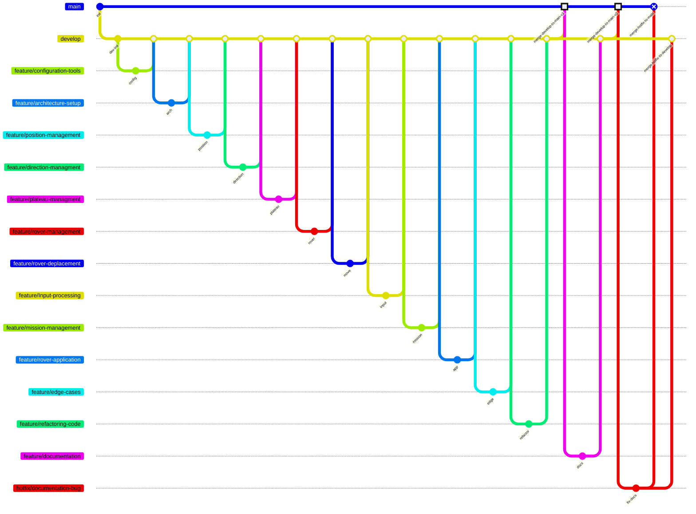

# 🚀 Mars Rover Simulation

**Robotic Rover Navigation System**  
*A Java project following SOLID principles with TDD*

---

## 📖 Table of Contents

### 📚 Documentation
- [Project Overview](#-key-features)
- [Development Stack](#-development-stack)
- [Project Structure](#-project-structure)
- [Development Workflow](#-development-workflow)
- [Quick Start](#-quick-start)
- [Usage Examples](#-usage-examples)

### 📋 Development Guides
- [Best Practices](#-best-practices)
- [Future Roadmap](#-future-roadmap)
- [Contact & Links](#-contact--links)

### 📑 Detailed Documentation
| Document | Description |
|----------|-------------|
| [Rover Description](docs/rover.txt) | Description of the rover simulation |
| [Changelog](docs/CHANGELOG.md) | History of changes and version updates |
| [Design Decisions](docs/DESIGN-DECISION.md) | Architecture and technical choices |
| [Test Strategy](docs/TEST-STRATEGY.md) | Testing approach and methodology |

---

## 🚀 Key Features
- Plateau grid system with boundary validation
- Rover movement commands (`L`/`R`/`M`)
- Direction handling (N/S/E/W) with enum logic
- Sequential processing of multiple rovers
- Graceful error handling & recovery

---

### Development Stack
[](https://www.oracle.com/java/) - Core Language  
[](https://maven.apache.org/) - Build Tool  
[](https://junit.org/junit5/) - Testing Framework  
[](https://www.jacoco.org/) - Test Coverage
[](https://checkstyle.sourceforge.io/) - Code Style Enforcement
[](https://spotbugs.github.io/) - Bug Detection
[](https://github.com/diffplug/spotless) - Code Formatter

---

## 🛠 Quick Start

### Prerequisites
- Java 17+
- Maven 3.9+

### Installation
```bash
# 1. Clone repository
git clone https://github.com/aitdahmane/rover-exercice.git

# 2. Build and run
mvn clean package
java -jar target/rover.jar input.txt
```

## 📚 Usage Examples

### Input Format
```
5 5
1 2 N
LMLMLMLMM
3 3 E
MMRMMRMRRM
```

### Expected Output
```
1 3 N
5 1 E
```

## 🏗 Project Structure
```
rover-exercice/
├── docs/                          # Documentation
│   ├── CHANGELOG.md               # Historique des versions
│   ├── DESIGN-DECISION.md         # Décisions d'architecture
│   ├── TEST-STRATEGY.md           # Stratégie de tests
│   └── rover.txt                  # Description du rover
├── rover/                         # Code source du projet
│   ├── pom.xml                    # Configuration Maven
│   ├── src/
│       ├── main/
│       │   └── java/
│       │       └── com/
│       │           └── nasa/
│       │               └── rover/
│       │                   ├── model/
│       │                   │   └── impl/      # Implémentations du modèle
│       │                   │       ├── Direction.java
│       │                   │       ├── Plateau.java
│       │                   │       ├── Position.java
│       │                   │       └── Rover.java
│       │                   ├── service/
│       │                   │   └── impl/      # Services de l'application
│       │                   │       ├── InputFileService.java
│       │                   │       ├── MissionService.java
│       │                   │       └── RoverControlService.java
│       │                   └── RoverApplication.java # Point d'entrée
│       └── test/
│           ├── java/
│           │   └── com/
│           │       └── nasa/
│           │           └── rover/
│           │               ├── model/impl/     # Tests unitaires du modèle
│           │               ├── service/impl/   # Tests unitaires des services
│           │               └── RoverApplicationTest.java
│           └── resources/
│               └── edge-cases/                # Fichiers de test
│                   ├── edge-positions.txt
│                   ├── empty-file.txt
│                   ├── invalid-format.txt
│                   ├── large-plateau.txt
│                   ├── minimal-plateau.txt
│                   └── multiple-rovers.txt
└── README.md                      # Documentation principale
```

---

## 📝 Development Workflow



---

## 🔧 Best Practices
- SOLID Principles: Clean separation of concerns
- TDD Approach: Comprehensive test coverage
- KISS Philosophy: Minimal complexity
- DRY Code: Reusable validation logic
- Error Handling: Robust exception management

## ➡️ Future Roadmap
- Collision detection between rovers
- 3D movement support
- Interactive visualization
- Docker containerization
- REST API interface

## 📬 Contact & Links
- Maintainer: Ayoub AIT DAHMANE
- Email: ayoub@aitdahmane.com
- Repository: github.com/aitdahmane/rover-exercice
- Issues: github.com/aitdahmane/rover-exercice/issues
