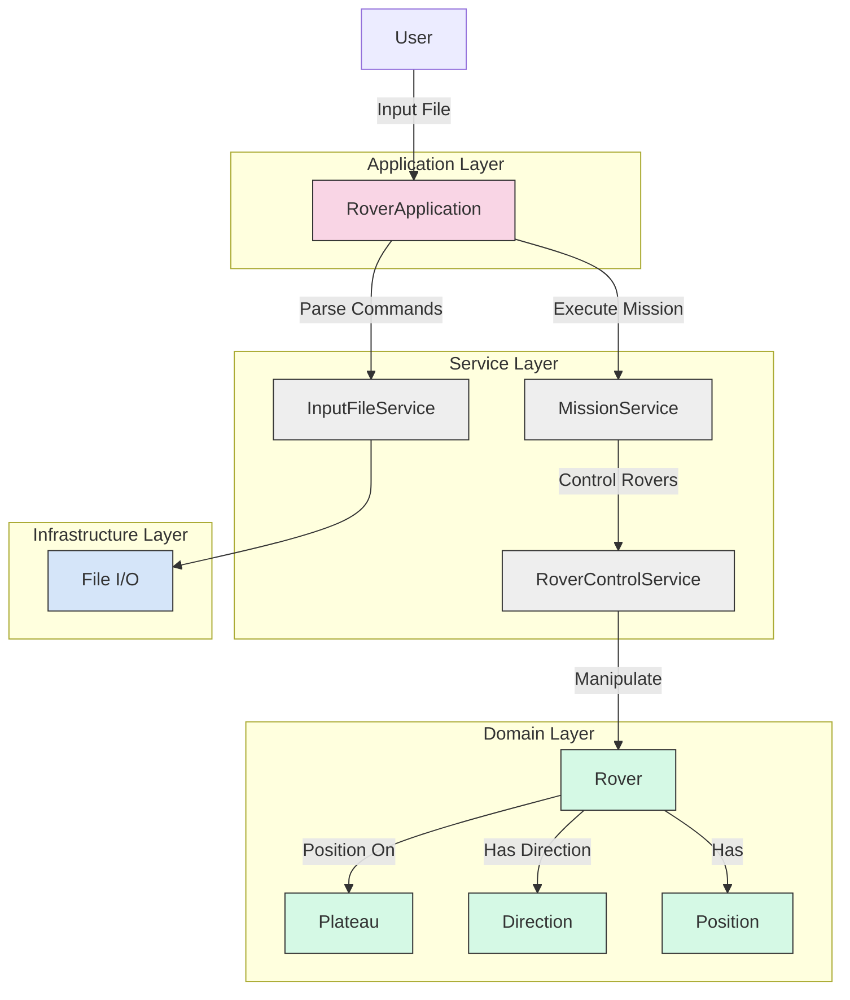
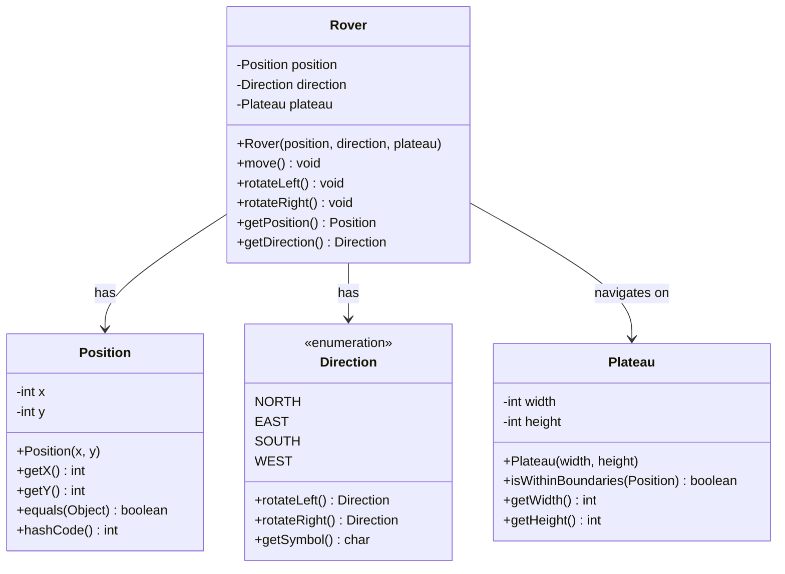

# Design Decisions

This document outlines the key design decisions and architectural choices made in the Mars Rover project.

## Table of Contents

- [Architecture Overview](#architecture-overview)
- [Domain Model](#domain-model)
- [Future Extensibility](#future-extensibility)

## Architecture Overview

The Mars Rover project is structured using a layered architecture to ensure separation of concerns:

1. **Application Layer** - Entry point that orchestrates the workflow
2. **Service Layer** - Contains business logic and processing rules
3. **Domain Layer** - Core models representing the problem domain
4. **Infrastructure Layer** - Handles external concerns (file I/O, configuration)

This design provides a clear separation between the rover's core functionality and the supporting infrastructure.

## Domain Model

### Core Domain Objects

1. **Plateau**
   - Represents the rectangular grid on which rovers move
   - Enforces boundary validation
   - Immutable after creation for safety

2. **Position**
   - Value object representing a specific x,y coordinate
   - Immutable for thread safety
   - Provides factory methods for position creation

3. **Direction**
   - Enum representing cardinal directions (N, E, S, W)
   - Encapsulates rotation logic (left/right)
   - Self-contained to isolate directional concepts

4. **Rover**
   - Aggregate root containing Position and Direction
   - Implements movement logic based on commands
   - Validates movements against plateau boundaries

## SOLID Principles Implementation

### Single Responsibility Principle
Each class has a single, well-defined responsibility:
- `Plateau` - Manages the grid boundaries
- `InputFileService` - Handles file parsing
- `RoverControlService` - Manages rover movement
- `MissionService` - Coordinates rover operations

### Open/Closed Principle
The system is designed to be open for extension but closed for modification:
- Abstract interfaces define behavior contracts
- New movement commands can be added without changing existing code
- Direction system can be extended with new orientations

### Liskov Substitution Principle
All implementations can be used interchangeably with their base types:
- Service implementations can be replaced without affecting clients

### Interface Segregation Principle
Interfaces are client-specific rather than general-purpose:
- Movement operations are separated from position management
- Input parsing is separated from mission control

### Dependency Inversion Principle
High-level modules depend on abstractions, not details:
- Services depend on interfaces, not concrete implementations
- Dependency injection is used throughout the application

## Future Extensibility

The system is designed to accommodate future enhancements:

1. **Collision Detection**
   - Service layer prepared for rover-to-rover collision detection
   - Position tracking infrastructure in place

2. **3D Movement**
   - Direction enum can be extended to support additional dimensions
   - Position model can accommodate z-coordinates

3. **Additional Commands**
   - Command processing designed for easy addition of new instructions
   - Service interfaces allow for new movement types

4. **Obstacle Support**
   - Plateau model can be extended to track obstacles
   - Movement validation ready for obstacle detection
