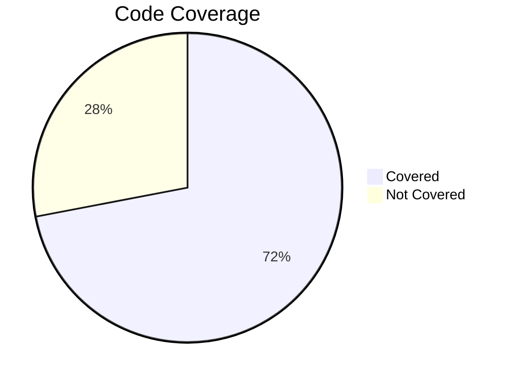

# Test Strategy

This document outlines the testing approach and methodology used in the Mars Rover project.

## Table of Contents

- [Testing Philosophy](#testing-philosophy)
- [Test Coverage](#test-coverage)
- [Test Types](#test-types)
- [Testing Tools](#testing-tools)
- [Continuous Integration](#continuous-integration)
- [Edge Case Testing](#edge-case-testing)
- [Best Practices](#best-practices)

## Testing Philosophy

The Mars Rover project follows a Test-Driven Development (TDD) approach:

1. **Write tests first**: Tests are written before implementation code
2. **Fail-first principle**: Verify that tests fail before implementing functionality
3. **Minimal implementation**: Write just enough code to make tests pass
4. **Refactor with confidence**: Clean up code knowing tests will catch regressions

This methodology ensures high test coverage and promotes good design by forcing developers to consider how components will be used before implementation.

## Test Coverage

The project maintains a test coverage target of 70%+ across all code:

Coverage breakdown by component:

| Component | Coverage % |
|-----------|------------|
| Domain Models | 85% |
| Services | 79% |
| Application | 65% |

Coverage metrics are generated using JaCoCo.

## Test Types

### Unit Tests

The primary testing approach focuses on thorough unit testing:

- **Model Tests**: Verify behavior of domain objects
  - Direction rotation logic
  - Position creation and validation
  - Plateau boundary checking
  - Rover movement and rotation

- **Service Tests**: Validate service behaviors
  - Input file parsing and validation
  - Command execution sequences
  - Error handling and recovery

### Integration Tests

Integration tests validate the interaction between components:

- **Mission Execution**: Tests the end-to-end flow from input parsing to rover movement
- **Error Propagation**: Ensures errors are properly handled across component boundaries

### System Tests 

System-level tests validate the application's behavior from an external perspective:

- **Command-line Execution**: Tests running the application via command line
- **Input/Output Validation**: Verifies correct parsing of input files and generation of output

## Testing Tools

The project leverages several tools for testing:

1. **JUnit 5**: Core testing framework
   - Parameterized tests for comprehensive validation
   - Dynamic tests for generated test cases
   - Extended assertions for detailed validation

2. **JaCoCo**: Code coverage reporting
   - Branch coverage metrics
   - Line coverage metrics
   - Integration with Maven build

3. **Mockito**: Mock object framework
   - Service dependency isolation
   - Behavior verification
   - Argument captors for interaction testing

4. **SpotBugs**: Static analysis
   - Identify potential bugs
   - Enforce code quality standards

5. **Checkstyle**: Code style validation
   - Consistent formatting
   - Documentation standards
   - Naming conventions

## Edge Case Testing

A comprehensive set of edge cases is tested using input file variations:

| Test Case | Description | Expected Behavior |
|-----------|-------------|-------------------|
| Empty File | File exists but is empty | Appropriate error message |
| Invalid Format | File with incorrect formatting | Parsing error with details |
| Edge Positions | Rovers positioned at plateau edges | Correct boundary enforcement |
| Minimal Plateau | 1x1 plateau size | Proper movement constraints |
| Large Plateau | Very large plateau dimensions | Correct handling without overflow |
| Multiple Rovers | Several rovers with complex paths | Proper sequential processing |

These edge cases are maintained as separate test files in the `resources/edge-cases/` directory and are automatically included in the test suite.

## Best Practices

The testing approach follows these best practices:

1. **Test Isolation**: Each test is independent and doesn't rely on state from previous tests
2. **Descriptive Names**: Test methods have clear, descriptive names explaining what they verify
3. **Given-When-Then**: Tests follow a clear structure with setup, action, and verification phases
4. **Single Assertion Principle**: Each test verifies one specific behavior
5. **Test Data Management**: Test data is clearly separated from test logic
6. **Maintainable Tests**: Tests are treated as first-class code with refactoring and maintenance

## Future Improvements

Planned testing enhancements:

1. **Property-based Testing**: Implement property-based tests for more thorough validation
2. **Mutation Testing**: Add mutation testing to verify test quality
3. **Performance Tests**: Implement benchmarks for critical operations
4. **Code Coverage Expansion**: Increase coverage target to 80%+
5. **Automated UI Testing**: Add tests for any future UI components
